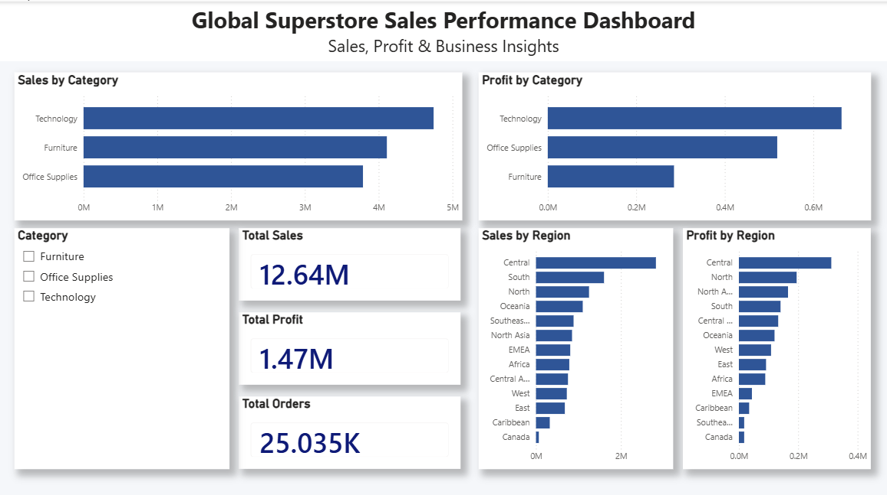
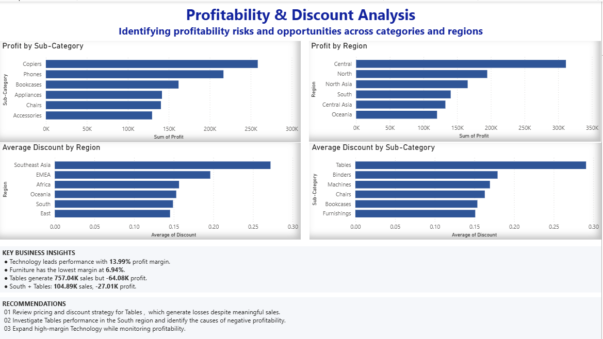

# Global Superstore E-Commerce Sales & Profitability Analysis

## 📊 Project Overview

This project analyzes the Global Superstore dataset to identify sales performance, profitability trends, discount patterns, and regional business opportunities.

The analysis combines **SQL data analysis** with an interactive **Power BI dashboard** to transform raw e-commerce data into actionable business insights and recommendations.

---

## 🎯 Business Objective

The main objective of this project is to answer key business questions such as:

- Which categories generate the highest sales and profit?
- Which sub-categories are contributing to losses?
- Which regions perform best and worst?
- How do discount levels relate to profitability?
- Where should the business focus its improvement efforts?
- Which areas provide opportunities for profitable growth?

---

## 🛠️ Tools & Technologies

- **SQL** – Data analysis and business queries
- **Power BI Desktop** – Interactive dashboard and visualization
- **CSV** – Cleaned source dataset
- **SQLite** – Database storage and analysis
- **GitHub** – Project documentation and submission

---

## 📁 Project Files

| File | Description |
|------|-------------|
| `ECOMM_DATA_CLEANED.csv` | Cleaned Global Superstore dataset |
| `ecommerce_new.db` | SQLite database containing the project data |
| `ecommerce_analysis.sql` | SQL queries used for analysis |
| `ecommerce_insights_dashboard.pbix` | Interactive Power BI dashboard |
| `Global_Superstore_Insights_Report.pdf` | Business insights and recommendations report |
| `README.md` | Project documentation |

---

## 📈 Power BI Dashboard

The Power BI dashboard contains two pages designed for both executive-level monitoring and detailed profitability analysis.

### Page 1 – Global Superstore Sales Performance

The executive dashboard provides an overview of:

- Total Sales
- Total Profit
- Total Orders
- Sales by Category
- Profit by Category
- Sales by Region
- Profit by Region
- Category and Region filters

### Page 2 – Profitability & Discount Analysis

The analysis dashboard focuses on:

- Profit by Sub-Category
- Profit by Region
- Average Discount by Sub-Category
- Average Discount by Region
- Key Business Insights
- Actionable Recommendations

---

## 📸 Dashboard Preview

### Page 1 – Sales Performance

### Page 2 – Profitability & Discount Analysis

---

## 🔍 Key Business Insights

### 1. Technology is the strongest-performing category

Technology is the strongest-performing category, with a **13.99% profit margin**.

This indicates an opportunity to continue growing Technology while maintaining disciplined pricing and profitability.

### 2. Furniture has the lowest category profit margin

Furniture has the lowest category profit margin at **6.94%**.

This suggests that pricing, product costs, and discount strategies should be reviewed to improve profitability.

### 3. Tables is a loss-making sub-category

Tables generates approximately **757.04K in sales** but produces a **-64.08K loss**, resulting in a **-8.46% profit margin**.

The high average discount associated with Tables also indicates that discounting may be contributing to the profitability problem.

### 4. Tables performance in the South region requires attention

Tables in the South region generate approximately:

- **104.89K Sales**
- **-27.01K Profit**
- **-25.75% Profit Margin**

This makes the South region an important area for further investigation.

---

## 💡 Business Recommendations

### 1. Review Pricing and Discount Strategy for Tables

Review selling prices, product costs, and discount levels for Tables. Introduce tighter discount controls where discounts are significantly reducing profitability.

**Expected impact:** Reduce losses and improve the profit margin of the Tables sub-category.

### 2. Investigate Tables Performance in the South Region

Analyze South-region Tables transactions to identify the causes of negative profitability, including:

- Pricing
- Discounts
- Shipping costs
- Product costs
- Customer and order mix

**Expected impact:** Identify the specific drivers of negative profitability and determine appropriate corrective actions.

### 3. Expand Technology While Protecting Margins

Continue focusing growth efforts on high-performing Technology products while monitoring pricing and profitability to prevent margin erosion.

**Expected impact:** Increase profitable revenue while maintaining healthy margins.

---

## 📊 Overall Business Performance

The dashboard shows approximately:

| Metric | Value |
|--------|------:|
| Total Sales | 12.64M |
| Total Profit | 1.47M |
| Total Orders | 25.035K |

These results provide a high-level view of overall business performance while the detailed analysis identifies specific profitability risks.

---

## 🚀 Project Outcome

This project demonstrates how raw e-commerce data can be transformed into a business-focused analytical solution using SQL and Power BI.

The final dashboard helps stakeholders:

- Monitor overall sales and profitability
- Identify underperforming categories and regions
- Understand discount patterns
- Detect loss-making segments
- Prioritize corrective actions
- Identify opportunities for profitable growth

---

## 📌 Conclusion

The analysis highlights a strong overall business performance but also identifies significant profitability differences across categories, sub-categories, and regions.

Technology represents a strong growth opportunity, while Tables requires immediate profitability attention, particularly in the South region.

The recommended approach is to **reduce losses in Tables, investigate the South-region problem at the transaction level, and continue growing Technology while protecting margins**.

The combination of **SQL analysis, Power BI visualization, and actionable recommendations** provides a data-driven foundation for improving profitability and supporting better business decisions.
